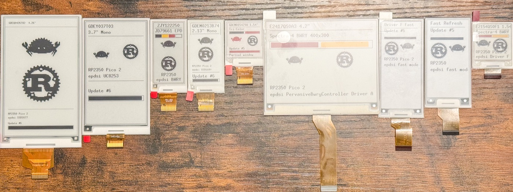

# epdsi: E-Paper Display Serial Interface Framework

[](https://crates.io/crates/epdsi)
[](https://docs.rs/epdsi)
[](https://github.com/melastmohican/epdsi/actions/workflows/ci.yml)
[](LICENSE-MIT)

A `no_std`, [`embedded-hal`](https://github.com/rust-embedded/embedded-hal) 1.0 compatible Rust driver framework for Electronic Paper Displays (EPD).



*Every panel above driven by `epdsi` on an RP2350 Pico 2 — left to right: `GDEQ0426T82` (SSD1677),
`GDEY037T03` (UC8253), `ZJY122250` (JD79661), `GDEM0213B74` (SSD1680), `GDEM0154Z90` (SSD1681),
`E2417QS0A3` and `E2154QS0F1` (Pervasive Spectra-4 BWRY, Drivers A and F).*

## Features

- **Modular Architecture**: Decouples driver IC logic (`EpdController`) from physical panel specifications (`EpdPanel`).
- **`embedded-hal` 1.0 Compatible**: Built around standard `SpiDevice`, `OutputPin`, `InputPin`, and `DelayNs` traits.
- **Low-RAM Paged Rendering**: Built-in support for GxEPD2-style closure-based paged graphics rendering using tiny stack buffers.
- **`embedded-graphics` Integration**: Implements `DrawTarget` and `Dimensions` via optional `graphics` feature (enabled by default).
- **Multi-Color Support**: Unified handling for Monochrome, Tri-Color (Black/White/Red), Quad-Color (Black/White/Yellow/Red 2bpp), and 7-Color ACeP displays.
- **Automatic RAM Alignment**: Driver IC controllers automatically align panel widths to hardware byte boundaries (`div_ceil(8) * 8`).

## Supported Controllers & Panels

| Controller IC | Supported Panels | Resolution | Color Mode | Notes |
| :--- | :--- | :--- | :--- | :--- |
| **SSD1681** (`Ssd1681Controller` / `Ssd168xController`) | `GDEM0154Z90` | 200 × 200 | Tri-Color | 1.54" Tri-Color SPI panel, Full refresh only (~14 s). `Ssd168xRefreshMode::Partial` is **not** usable — see [note below](#tri-color-panels-and-partial-refresh). Partial *window* updates work via `set_window` at full-refresh speed |
| **SSD1680(Z)** (`Ssd1680Controller` / `Ssd168xController`) | `GDEM0213B74` | 122 × 250 | Monochrome | 2.13" Monochrome (Adafruit 6383), Full/Partial refresh |
| **JD79661** (`Jd79661Controller`) | `ZJY122250_0213AJH_E5` / `GDEY0213F51` | 122 × 250 | Quad-Color | 2.13" Quad-Color ([Good Display GDEY0213F51](https://www.good-display.com/product/463.html), [Seeed Studio 5779](https://www.seeedstudio.com/2-13-Quadruple-Color-ePaper-Display-with-122x250-Pixels-p-5779.html), [Adafruit 6373](https://www.adafruit.com/product/6373), Active-Low BUSY) |
| **UC8253** (`Uc8253Controller`) | `GDEY037T03` (`GxEPD2_370_GDEY037T03`) | 240 × 416 | Monochrome | 3.7" Monochrome (Adafruit 6395), Active-Low BUSY, Full/FastFull/Partial/FastPartial refresh |
| **SSD1677** (`Ssd1677Controller`) | `GDEQ0426T82` | 800 × 480 | Monochrome | 4.26" Monochrome (Seeed Studio 6398, SE8350/SSD1677), Full/FastFull/Partial refresh |
| **ED2208** (`Ed2208Controller`) | `GDEP073E01` (`GxEPD2_730c_GDEP073E01`) | 800 × 480 | 7-Color ACeP | 7.3" 7-Color (Seeed reTerminal E1002, Waveshare PhotoPainter) |
| **Pervasive Displays** (`PervasiveBwController`) | `E2266KS0C1` (`EPD_266_KS_0C`), `E2290KS0F1` (`EPD_290_KS_0F`) | 152 × 296, 168 × 384 | Monochrome | Pervasive Displays 2.66" (Driver C) & 2.90" (Driver F) Panels |
| **Pervasive Displays BWRY** (`PervasiveBwryController`) | `E2154QS0F1` (`EPD_154_QS_0F`), `E2417QS0A3` (`EPD_417_QS_0A`) | 152 × 152, 400 × 300 | Quad-Color (Spectra-4) | Pervasive Displays 1.54" (Driver F) & 4.2" (Driver A), OTP-sourced registers read via a bit-banged 3-wire handshake (`epdsi::bus3::Spi3Bus`), Active-Low BUSY |

> **Hardware Note for EXT3-1 Extension Boards:** Ensure the **J3 jumper** is **OPEN** ($10\,\mu\text{H}$ inductor path) for panels $\le 3.7"$ (e.g. 2.66" and 2.9" panels). If J3 is closed ($47\,\mu\text{H}$ path), the DC-DC booster chokes during current bursts, causing voltage sags and BUSY pin hangs.

### Tri-Color panels and partial refresh

Colour panels have **no fast/differential waveform**. The red (or yellow) pigment is a
heavier particle that needs the full OTP waveform to migrate, so *every* update on a
Tri-Color or Quad-Color panel takes seconds — roughly 14 s on the `GDEM0154Z90`.

`Ssd168xRefreshMode::Partial` drives `UPDATE_DISPLAY_CTRL2 = 0xFC`, selecting the
controller's built-in fast LUT. That LUT only exists for monochrome panels. On a colour
panel it is **not** a speed-up and actively breaks the image: the update runs at full-refresh
speed anyway, and because the fast path only rewrites the Black/White RAM, all red content
is dropped. Keep colour panels on `Ssd168xRefreshMode::Full`.

Region-limited updates still work on colour panels — narrow the RAM window with
`set_window`/`set_cursor`, write **both** colour channels for that region, then refresh on
the `Full` waveform. Only the windowed area is redrawn, but it costs a full refresh. This
mirrors GxEPD2's `GxEPD2_154_Z90c`, where `partial_refresh_time == full_refresh_time` and
`hasFastPartialUpdate == false`.

For genuine sub-second differential updates, use a monochrome panel: `GDEM0213B74`
(`Ssd1680RefreshMode::Partial`), `GDEY037T03` (`Uc8253RefreshMode::FastPartial`),
`GDEQ0426T82` (`Ssd1677RefreshMode::Partial`), or the Pervasive Displays panels via
`PervasiveRefreshMode::Fast` and `write_fast_frame`.

## Quick Start

Add `epdsi` to your `Cargo.toml`:

```toml
[dependencies]
epdsi = "0.1.0"
embedded-graphics = "0.8"
```

### Cargo features

| Feature | Default | Description |
| :--- | :---: | :--- |
| `graphics` | yes | Implements `embedded-graphics-core`'s `DrawTarget` and `Dimensions` for `PageBuffer`. Disable it to drop the `embedded-graphics-core` dependency; `PageBuffer` and `render_paged` still work, you just draw into the buffer yourself. |
| `defmt` | no | Derives `defmt::Format` on the public error and mode enums (`EpdBusError`, `Spi3BusError`, `PervasiveBwryOtpError`, `ColorMode`, `ColorChannel`, `SevenColor`, and the per-controller refresh/variant enums) for logging on embedded targets. |

The minimum supported Rust version is **1.75**.

The snippets below are abridged; for complete flashable programs see [Examples on real hardware](#examples-on-real-hardware).

### 1. Usage Example (SSD1681 Controller + GDEM0154Z90 Panel)

```rust,ignore
use epdsi::prelude::*;
use embedded_graphics::{prelude::*, primitives::{Rectangle, PrimitiveStyle}, pixelcolor::BinaryColor, geometry::{Point, Size}};

// Initialize SPI bus wrapper and controller
let epd_bus = SpiBusWrapper::new(spi_device, dc_pin, rst_pin, busy_pin);
let controller = Ssd1681Controller::new(GDEM0154Z90::WIDTH, GDEM0154Z90::HEIGHT);

// Build driver orchestrator
let mut epd = EpdBuilder::<_, GDEM0154Z90>::new(controller).build(epd_bus);

// Initialize display
epd.init(&mut delay).unwrap();

// Clear RAM channels
epd.clear_frame(ColorChannel::BlackWhite, 0xFF).unwrap();
epd.clear_frame(ColorChannel::RedYellow, 0x00).unwrap();

// Render graphics using PageBuffer
let mut bw_buf = [0xFFu8; (200 * 200 / 8) as usize];
let mut display = PageBuffer::new(&mut bw_buf, 200, 200, 0);

Rectangle::new(Point::new(10, 10), Size::new(50, 50))
    .into_styled(PrimitiveStyle::with_fill(BinaryColor::On))
    .draw(&mut display)
    .unwrap();

// Send frame and refresh display
epd.write_frame(ColorChannel::BlackWhite, display.as_slice()).unwrap();
epd.refresh(&mut delay).unwrap();
```

### 2. Usage Example (JD79661 Controller + 2.13" Quad-Color Panel)

```rust,ignore
use epdsi::prelude::*;

// Initialize SPI bus wrapper and JD79661 controller
let epd_bus = SpiBusWrapper::new(spi_device, dc_pin, rst_pin, busy_pin);
let controller = Jd79661Controller::new(ZJY122250_0213AJH_E5::WIDTH, ZJY122250_0213AJH_E5::HEIGHT);

// Build driver for Adafruit 6373 Quad-Color 122x250 display
let mut epd = EpdBuilder::<_, ZJY122250_0213AJH_E5>::new(controller).build(epd_bus);

epd.init(&mut delay).unwrap();

// Send 2bpp packed QuadColor frame buffer (8,000 bytes for 128x250 hardware RAM)
epd.write_frame(ColorChannel::BlackWhite, &quad_color_frame_buf).unwrap();
epd.refresh(&mut delay).unwrap();
```

### 3. Usage Example (PervasiveBwController + E2266KS0C1 Panel)

```rust,ignore
use epdsi::prelude::*;

// Initialize SPI bus wrapper and Pervasive Displays controller
let epd_bus = SpiBusWrapper::new(spi_device, dc_pin, rst_pin, busy_pin);
let controller = PervasiveBwController::new(E2266KS0C1::WIDTH, E2266KS0C1::HEIGHT);

// Build driver for Pervasive Displays 2.66" 152x296 Monochrome panel
let mut epd = EpdBuilder::<_, E2266KS0C1>::new(controller).build(epd_bus);

epd.init(&mut delay).unwrap();

// Clear RAM channel and refresh
epd.clear_frame(ColorChannel::BlackWhite, 0xFF).unwrap();
epd.refresh(&mut delay).unwrap();
epd.sleep(&mut delay).unwrap();
```

### 4. Usage Example (ED2208 Controller + GDEP073E01 7-Color Panel)

```rust,ignore
use epdsi::prelude::*;

// Initialize SPI bus wrapper and ED2208 controller
let epd_bus = SpiBusWrapper::new(spi_device, dc_pin, rst_pin, busy_pin);
let controller = Ed2208Controller::new(GDEP073E01::WIDTH, GDEP073E01::HEIGHT);

// Build driver for 7.3" 800x480 7-Color EPD display (e.g. Seeed reTerminal E1002)
let mut epd = EpdBuilder::<_, GDEP073E01>::new(controller).build(epd_bus);

epd.init(&mut delay).unwrap();

// Clear display frame buffer (fill with White, 0x11)
epd.clear_frame(ColorChannel::Color7(0), SevenColor::pack(SevenColor::White, SevenColor::White)).unwrap();

// Send 4bpp packed 7-color frame buffer (192,000 bytes for 800x480)
epd.write_frame(ColorChannel::Color7(0), &seven_color_frame_buf).unwrap();
epd.refresh(&mut delay).unwrap();
```

### 5. Usage Example (Ssd1680Controller + GDEM0213B74 Panel)

```rust,ignore
use epdsi::prelude::*;

// Initialize SPI bus wrapper and SSD1680(Z) controller
let epd_bus = SpiBusWrapper::new(spi_device, dc_pin, rst_pin, busy_pin);
let controller = Ssd1680Controller::new(GDEM0213B74::WIDTH, GDEM0213B74::HEIGHT)
    .with_refresh_mode(Ssd1680RefreshMode::Full);

// Build driver for Adafruit 6383 2.13" Monochrome display
let mut epd = EpdBuilder::<_, GDEM0213B74>::new(controller).build(epd_bus);

epd.init(&mut delay).unwrap();
epd.clear_frame(ColorChannel::BlackWhite, 0xFF).unwrap();
epd.refresh(&mut delay).unwrap();
epd.sleep(&mut delay).unwrap();
```

### 6. Usage Example (Uc8253Controller + GDEY037T03 Panel)

```rust,ignore
use epdsi::prelude::*;

// Initialize SPI bus wrapper and UC8253 controller (note: this panel's BUSY pin is active-low)
let epd_bus = SpiBusWrapper::new(spi_device, dc_pin, rst_pin, busy_pin);
let controller = Uc8253Controller::new(GDEY037T03::WIDTH, GDEY037T03::HEIGHT)
    .with_refresh_mode(Uc8253RefreshMode::FastFull);

// Build driver for Adafruit 6395 3.7" Monochrome display
let mut epd = EpdBuilder::<_, GDEY037T03>::new(controller).build(epd_bus);

epd.init(&mut delay).unwrap();
epd.clear_frame(ColorChannel::BlackWhite, 0xFF).unwrap();
epd.refresh(&mut delay).unwrap();
epd.sleep(&mut delay).unwrap();
```

### 7. Usage Example (Ssd1677Controller + GDEQ0426T82 Panel)

```rust,ignore
use epdsi::prelude::*;

// Initialize SPI bus wrapper and SSD1677 controller
let epd_bus = SpiBusWrapper::new(spi_device, dc_pin, rst_pin, busy_pin);
let controller = Ssd1677Controller::new(GDEQ0426T82::WIDTH, GDEQ0426T82::HEIGHT);

// Build driver for Seeed Studio 6398 4.26" Monochrome display
let mut epd = EpdBuilder::<_, GDEQ0426T82>::new(controller).build(epd_bus);

epd.init(&mut delay).unwrap();
epd.clear_frame(ColorChannel::BlackWhite, 0xFF).unwrap();
epd.refresh(&mut delay).unwrap();
epd.sleep(&mut delay).unwrap();
```

### 8. Usage Example (PervasiveBwryController + E2154QS0F1 Panel)

```rust,ignore
use epdsi::prelude::*;

// The BWRY OTP register read is a bit-banged 3-wire handshake (SCK + a single bidirectional
// DATA line), NOT the hardware SPI peripheral — the panel drives its response back on MOSI, and
// MISO is never used. `sck`/`mosi` must start as plain GPIO here (not SPI-function-bound) so
// `read_otp` can flip `mosi`'s direction; `mosi` must implement `epdsi::bus3::DynamicPin`.
let mut controller = PervasiveBwryController::new(E2154QS0F1::WIDTH, E2154QS0F1::HEIGHT)
    .with_variant(PervasiveBwryVariant::DriverF)
    .with_temperature(25);
let mut bus3 = Spi3Bus::new(cs_pin, sck_pin, mosi_pin, dc_pin, rst_pin, busy_pin);
controller.read_otp(&mut bus3, &mut delay).unwrap();
let (cs_pin, sck_pin, mosi_pin, dc_pin, rst_pin, busy_pin) = bus3.release();

// Reconfigure sck_pin/mosi_pin into the hardware SPI peripheral's function, build the SPI
// device, then wrap it with the normal 4-wire SpiBusWrapper for everything else.
let epd_bus = SpiBusWrapper::new(spi_device, dc_pin, rst_pin, busy_pin);
let mut epd = EpdBuilder::<_, E2154QS0F1>::new(controller).build(epd_bus);

epd.init(&mut delay).unwrap();

// Send 2bpp packed BWRY frame buffer (5,776 bytes for the 152x152 panel)
epd.write_frame(ColorChannel::BlackWhite, &bwry_frame_buf).unwrap();
epd.refresh(&mut delay).unwrap();
epd.sleep(&mut delay).unwrap();
```

## Examples on real hardware

The snippets above are `rust,ignore` because they need real SPI and GPIO. For complete,
flashable programs covering every supported controller, see:

- [`rust-rpico2-discovery`](https://github.com/melastmohican/rust-rpico2-discovery) — RP2350 Pico 2, `rp-hal`
- [`rust-reterminal-e1002-examples`](https://github.com/melastmohican/rust-reterminal-e1002-examples) — Seeed reTerminal E1002 (XIAO ESP32-S3), Embassy + `esp-hal`

| Example | Controller | Panel | Board |
| :--- | :--- | :--- | :--- |
| [`ssd1681_gdem0154z90_epd.rs`](https://github.com/melastmohican/rust-rpico2-discovery/blob/main/examples/ssd1681_gdem0154z90_epd.rs) | `Ssd1681Controller` | `GDEM0154Z90` — 1.54" Tri-Color | RP2350 |
| [`ssd1680_gdem0213b74_epd.rs`](https://github.com/melastmohican/rust-rpico2-discovery/blob/main/examples/ssd1680_gdem0213b74_epd.rs) | `Ssd1680Controller` | `GDEM0213B74` — 2.13" Mono | RP2350 |
| [`jd79661_zjy122250_epd.rs`](https://github.com/melastmohican/rust-rpico2-discovery/blob/main/examples/jd79661_zjy122250_epd.rs) | `Jd79661Controller` | `ZJY122250_0213AJH_E5` — 2.13" Quad-Color | RP2350 |
| [`uc8253_gdey037t03_epd.rs`](https://github.com/melastmohican/rust-rpico2-discovery/blob/main/examples/uc8253_gdey037t03_epd.rs) | `Uc8253Controller` | `GDEY037T03` — 3.7" Mono | RP2350 |
| [`ssd1677_gdeq0426t82_epd.rs`](https://github.com/melastmohican/rust-rpico2-discovery/blob/main/examples/ssd1677_gdeq0426t82_epd.rs) | `Ssd1677Controller` | `GDEQ0426T82` — 4.26" Mono | RP2350 |
| [`pdi_e2266ks0c1.rs`](https://github.com/melastmohican/rust-rpico2-discovery/blob/main/examples/pdi_e2266ks0c1.rs) | `PervasiveBwController` (Driver C) | `E2266KS0C1` — 2.66" Mono | RP2350 |
| [`pdi_e2290ks0f1.rs`](https://github.com/melastmohican/rust-rpico2-discovery/blob/main/examples/pdi_e2290ks0f1.rs) | `PervasiveBwController` (Driver F) | `E2290KS0F1` — 2.90" Mono | RP2350 |
| [`pdi_e2154qs0f1.rs`](https://github.com/melastmohican/rust-rpico2-discovery/blob/main/examples/pdi_e2154qs0f1.rs) | `PervasiveBwryController` (Driver F) | `E2154QS0F1` — 1.54" Spectra-4 | RP2350 |
| [`pdi_e2417qs0a3.rs`](https://github.com/melastmohican/rust-rpico2-discovery/blob/main/examples/pdi_e2417qs0a3.rs) | `PervasiveBwryController` (Driver A) | `E2417QS0A3` — 4.2" Spectra-4 | RP2350 |
| [`epd_ed2208_demo.rs`](https://github.com/melastmohican/rust-reterminal-e1002-examples/blob/main/examples/epd_ed2208_demo.rs) | `Ed2208Controller` | `GDEP073E01` — 7.3" ACeP | ESP32-S3 |
| [`epd_ed2208_bmp.rs`](https://github.com/melastmohican/rust-reterminal-e1002-examples/blob/main/examples/epd_ed2208_bmp.rs) | `Ed2208Controller` | `GDEP073E01` — 7.3" ACeP, BMP rendering | ESP32-S3 |

Between the two repos every supported controller has a working example, across both
Cortex-M (RP2350) and Xtensa (ESP32-S3) hosts.

## License

Licensed under either of:

- Apache License, Version 2.0 ([LICENSE-APACHE](LICENSE-APACHE) or <http://www.apache.org/licenses/LICENSE-2.0>)
- MIT license ([LICENSE-MIT](LICENSE-MIT) or <http://opensource.org/licenses/MIT>)

at your option.
